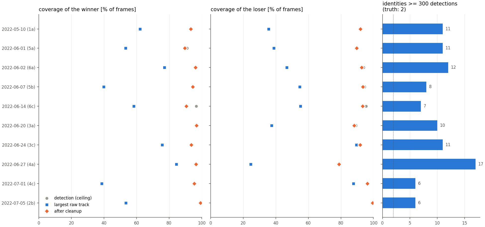
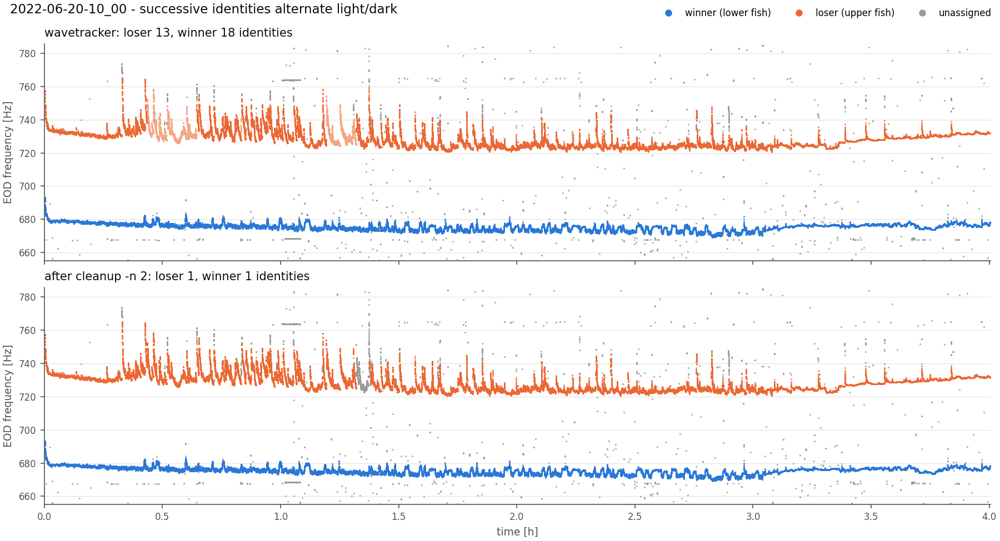

# wavetracker

[](https://doi.org/10.3389/fnint.2022.965211)

Detect and track the EOD frequencies of individual **wave-type electric fish**
in long, multi-electrode recordings.

The pipeline:

1. **Spectrogram** – one-sided power spectral densities of every electrode,
   computed block-wise on the GPU with PyTorch (CPU works too).
   Stationary interference combs are detected and removed per electrode.
2. **Harmonic groups** – peaks of the electrode-summed spectrum are grouped
   into harmonic series; each group is one fish (parallel numba code).
3. **Tracking** – detections are linked into identities using their
   frequency and their amplitude pattern across electrodes
   ([Raab et al. 2022](https://doi.org/10.3389/fnint.2022.965211)).
4. **Stitching** – track fragments are joined across rises, dropouts and
   short double detections.

Set the frequency range of your fish (see [Usage](#usage)); the default
range is a broad catch-all.

It runs at several hundred times realtime on an 11-channel, 20 kHz recording
(a 4 h recording takes about a minute on an RTX 4080, mostly disk IO).

## Installation

Requires Python ≥ 3.11. With [uv](https://docs.astral.sh/uv/):

```bash
git clone https://github.com/weygoldt/wavetracker.git
cd wavetracker
uv sync                 # add --extra gui for the EOD sorter GUI
uv run wavetracker --help
```

or with pip into an existing environment: `pip install -e ".[gui]"`.

PyTorch from PyPI ships with CUDA support on Linux; the GPU is used
automatically when available (`--device cpu` forces the CPU).

## Usage

```bash
wavetracker info  /data/2022-05-10-10_00                 # channels, rate, duration
wavetracker run   /data/2022-05-10-10_00 -o results/0510 # detect + track
wavetracker run   /data/2022-05-10-10_00 -o test --start 3600 --duration 300
wavetracker summary results/0510                          # table of identities
wavetracker plot    results/0510 -o tracks.png            # tracks on spectrogram
wavetracker track   results/0510 -c my_config.yaml        # re-track only
```

> **Important: set the fish frequency range explicitly, as narrow as you
> can.** The default (fundamentals from 80 to 2400 Hz) is a catch-all for
> unknown populations, from *Sternopygus* to the fastest *Apteronotus*. If
> you know the EOD frequencies of your fish, or the range they can be
> expected in, restrict `harmonic_groups.min_freq`/`max_freq` to a narrow
> band around it (with some margin for drift and rises). This maximizes
> performance in every respect:
>
> * **Interference removal.** Hum combs are only removed if they are spaced
>   closer than the lowest fish frequency (anything wider could be a
>   resting fish's harmonic series). With the default range that is only
>   combs below 72 Hz; with 400–1200 Hz combs up to 300 Hz are removed.
> * **Fewer false fish.** Harmonics and interference outside the band cannot
>   become fish. On a grid recording with a 95 Hz hum comb the default range
>   gave 3× the detections and `cleanup -n 2` coverage dropped from 92 % to
>   50 %; with 400–1200 Hz the result was clean.
> * **Speed.** ~3× faster detection (17 s instead of 51 s for 4 h).
>
> ```yaml
> harmonic_groups:
>   min_freq: 400.0   # e.g. Apteronotus leptorhynchus in the lab
>   max_freq: 1200.0
> ```
>
> `wavetracker run` prints a reminder when the default range is in use.

`run` accepts a single file, a fishgrid recording directory
(`traces-grid*.raw` + `fishgrid.cfg`) or a directory with a sequence of audio
files (read as one continuous recording via
[thunderlab](https://github.com/bendalab/thunderlab)). Several inputs can be
given at once; each gets a subdirectory of `--output`. Existing results are
skipped unless `-f/--overwrite` is given.

Post-processing and tools:

| command | purpose |
|---|---|
| `wavetracker cleanup DIR -n 2` | join/filter tracks, keep the N most prominent fish |
| `wavetracker merge-by-position DIR -e electrodes.npz` | group track segments into fish by frequency and position (moving electrodes) |
| `wavetracker concat DAY1 DAY2 … -o OUT` | concatenate consecutive recordings |
| `wavetracker freq-analysis DIRS…` | top-N frequencies at fixed times of day |
| `wavetracker sorter DIR` | GUI for manual track correction (`--extra gui`) |
| `wavetracker synth out.wav -n 4` | synthetic recording with ground truth |
| `wavetracker config [FILE]` | print or write the default configuration |

### Configuration

All parameters live in one YAML file; `wavetracker config cfg.yaml` writes the
defaults, pass your edited copy with `-c cfg.yaml`. Unknown keys are an error.
The most relevant parameters:

| parameter | default | meaning |
|---|---|---|
| `spectrogram.nfft` | 32768 | FFT window (0.61 Hz resolution at 20 kHz) |
| `spectrogram.overlap_frac` | 0.9 | window overlap (0.16 s frame step) |
| `spectrogram.exclude_channels` | `[]` | broken/noisy electrodes to ignore (`run -x 8`) |
| `interference.enabled` | true | remove interference combs (`run --no-interference`) |
| `interference.level_history_blocks` | 5 | gate-level memory; 2 follows changing hum faster, costs fish detections near teeth |
| `harmonic_groups.min_freq` / `max_freq` | 80 / 2400 | fundamental frequency range [Hz]; set it for your species (see above) |
| `harmonic_groups.low_thresh_factor` / `high_thresh_factor` | 6 / 10 | peak thresholds in units of the noise std |
| `harmonic_groups.min_group_size` | 3 | harmonics 1..n that must all be present |
| `harmonic_groups.max_missing_harmonics` | 0 | gaps allowed: fundamental + `min_group_size` of the first `min_group_size + n` harmonics (odd-harmonic fish) |
| `harmonic_groups.min_good_peak_power` | -100 | absolute power limit for fundamentals [dB]; `null` for quiet audio recordings (a warning says when it binds) |
| `harmonic_groups.max_harmonics` | 10 | cap on harmonics per group (the original formula gives 89 for 80–2400 Hz) |
| `harmonic_groups.mains_freq` | 50 | mains harmonics are excluded; 0 disables (battery-powered recordings) |
| `harmonic_groups.exclusive_harmonics` | `core` | `all` reproduces the original grouping (see below) |
| `tracking.freq_tolerance` | 2.5 | max. frequency jump between linked detections [Hz] |
| `tracking.max_dt` | 10 | max. gap between linked detections [s] |
| `tracking.gap_tolerance` / `gap_tolerance_rate` | none / 0 | gap-dependent frequency tolerance `tol + rate * gap` (dense populations) |
| `tracking.amplitude_feature` | `minmax` | electrode pattern in the link error; `db` (level ratios) for few electrodes |
| `tracking.min_support` | 0 | only track detections with ≥ n neighbours within `support_window` s and `support_freq` Hz |
| `wavetracker harmonics --timescale` | 30 | flag harmonics tracked as fish by fast co-modulation (post-processing) |
| `stitching.enabled` | true | join fragments across rises, dropouts and double detections |
| `stitching.max_dropout` | 900 | longest gap bridged when nothing else is at that frequency [s] |
| `output.save_fine_spec` | false | also store the full-resolution spectrogram |
| `output.fine_spec_max_freq` / `sparse_spec_max_freq` | none | upper limit of the stored spectrograms; none = 1.25 × `harmonic_groups.max_freq` |
| `interference.max_line_freq` | none | upper limit of the hum-line search; none = Nyquist |

### Output

Each results directory holds plain NumPy files, compatible with the
post-processing tools and the sorter GUI:

| file | content |
|---|---|
| `fund_v.npy` | fundamental frequency of every detection [Hz] |
| `idx_v.npy` | frame index of every detection (into `times`) |
| `ident_v.npy` | identity of every detection (NaN = unassigned) |
| `sign_v.npy` | power at the fundamental on each electrode, `(n, channels)` |
| `cplx_v.npy` | complex spectrum at the fundamental on each electrode (`abs(cplx_v)**2 == sign_v`); the phase difference gives the relative sign of electrodes: `np.angle(cplx_v[:, 1] * np.conj(cplx_v[:, 0]))` |
| `times.npy` | time of each frame, relative to the recording start [s] |
| `sparse_spectra.npy`, `sparse_freq.npy`, `sparse_time.npy` | overview spectrogram (freq × time, power) |
| `fine_spec.npy`, `fine_freqs.npy`, `fine_times.npy` | optional full spectrogram (time × freq, `np.load(..., mmap_mode="r")`) |
| `wavetracker.json` | input, config, estimated thresholds, timings, version |

```python
from wavetracker.results import Results

r = Results.load("results/0510")
for fish in r.ids():
    m = r.ident_v == fish
    t, f = r.times[r.idx_v[m]], r.fund_v[m]
```

### Python API

```python
from wavetracker.config import Config
from wavetracker.pipeline import detect, track_results

cfg = Config.load("cfg.yaml")            # or Config()
out = detect("/data/rec", "results/rec", cfg, start=0, duration=600)
track_results(out.results, cfg)
out.results.save("results/rec")
```

`wavetracker.synthetic` generates recordings of fish with known frequency
traces and `wavetracker.evaluation.evaluate` scores results against them
(precision, recall, identity coverage and purity).

## Differences to the original implementation

The detection and tracking algorithms follow Raab et al. (2022). The tracker
is a numba port that reproduces the original `freq_tracking_v6` assignments
exactly in compatibility mode (verified in the test-suite), while being roughly 25× faster and
linear in recording length. Deliberate changes:

* **Harmonic exclusivity** – the original rejects a fish if *any* of its up to
  8 harmonics coincides with a peak of an already accepted fish. Because the
  harmonic tolerance grows with the harmonic number, high harmonics of one
  fish regularly capture a harmonic of another, which makes that fish
  disappear. By default only the `min_group_size` lowest harmonics are now
  exclusive (this still rejects in-range harmonics of other fish as ghosts).
  `exclusive_harmonics: all` restores the original behaviour.
* **Window-check bug** – when attaching a window's links to established
  identities, the original compared a detection's *position in the window*
  with the window's *frame count*, so the skipped span depended on the
  number of fish. It now checks the target's frame. In practice this rarely
  matters (on a 4 h recording it assigns ~100 more detections and changes no
  existing assignment); `track(..., v6_compat=True)` reproduces the original.
* **Interference removal** – new, see below.
* **Sub-bin frequencies** – fundamentals are refined by parabolic
  interpolation (`refine_frequency`), giving ~0.01 Hz precision instead of the
  0.61 Hz bin spacing.
* **Seamless blocks** – blocks are aligned to the STFT frame grid, so there
  are no edge artifacts or duplicate frames between blocks.
* Spectra are true PSDs (mlab `scale_by_freq` convention). They are 3 dB
  above the old hand-calibrated scale, which does not affect the
  noise-relative thresholds.

## Interference removal

Electrical interference often forms a *comb* of persistent lines at
consecutive multiples of a low fundamental (in the 2022 tube recordings:
95.4 Hz on all electrodes, plus 25, 55.5, 100 and 125 Hz combs). Each tooth's
harmonics are other teeth, so the harmonic-group detector cannot tell them
from fish. `wavetracker.interference` removes them before the channels are
summed. For every electrode and 60 s block it:

1. estimates the persistent spectrum: the 20th percentile over time, then
   the minimum over the last 5 blocks. A line must sit on the same bin for
   5 minutes.
2. finds lines ≥10 dB above a running-median noise baseline;
3. searches them for combs: spacing 20–300 Hz, at least 4 *consecutive* teeth
   within 0.3 Hz;
4. remembers every tooth found on an electrode for 30 minutes (single teeth
   intermittently fail the line test, which made the hum leak back), and
5. gates the remembered teeth: in each frame a tooth bin at or below the
   tooth's level (90th percentile + 3 dB, minimum over the history) is set to
   the noise floor; a bin above it contains a fish and is left untouched.

Where a fish overlaps a tooth (within the ~2 Hz main lobe), the gating can
split the fish's peak in two; two detections in one frame within 4 Hz with a
tooth between them are therefore merged into the stronger one. A strong fish
up to ~8 Hz away can also lift a tooth above the gate through its spectral
leakage, and the tracker then hands the fish's identity to the constant
tooth; a detection on a tooth with a stronger non-tooth detection within
8 Hz is therefore dropped.

The gate level is the minimum over the last 5 blocks. That protects fish
resting near a tooth but lags when the interference gets stronger, so some
hum still leaks as separate constant-frequency tracks (e.g. in the first hour
of 2022-06-02); `cleanup` discards them. `level_history_blocks: 2` follows the
interference faster at the cost of fish detections near teeth.

A fish is never a comb: its harmonics are spaced by its own fundamental
(≥ `min_freq`), and sub-multiples of it match only every 2nd/3rd tooth. So a
resting fish that is stable for hours and seen on a single electrode is kept
(tested with synthetic data). Gating rather than notching keeps a fish
visible while it passes a tooth, as long as it is stronger than the tooth.
The remaining blind spot is a fish that is **weaker than a tooth and stays
within ~1 Hz of it for 5+ minutes** on the same electrodes. At 0.6 Hz
resolution the two cannot be separated.

On the 4 h recording 2022-06-14 (no channel excluded) it removes the
interference detections (4.1 → 2.0 detections per frame for two fish) without
losing fish detections. The detected combs are listed in `wavetracker.json`
(`interference_combs`). It costs ~40 ms per 60 s block.

Because a stationary fish's harmonic series is itself a comb with spacing
equal to its fundamental, combs are only searched below
`interference.max_spacing`, by default `min(300, 0.9 × harmonic_groups.min_freq)`
(72 Hz for the default range, 300 Hz for 400–1200 Hz). A comb spaced wider
than the lowest fish frequency cannot be told apart from a resting fish and
is kept; restrict the fish range to remove it.

## Stitching

The tracker breaks a track at every rise: the onset jump exceeds
`freq_tolerance` and, by the time the frequency has decayed back, the gap
exceeds `max_dt`. `wavetracker.stitching` joins fragment A to a later
fragment B when their *baselines* (10th percentile of the frequency, which
ignores the upward rises) agree:

| situation | condition |
|---|---|
| gap ≤ 30 s | baselines within 3 Hz; a clear rise onset (gap ≤ 2 s, jump ≥ +3 Hz) may differ by 6 Hz |
| dropout ≤ 15 min | baselines within 1.5 Hz and no other track at that frequency during the gap |
| overlap ≤ 30 s (double detection) | same median frequency during the overlap (2.5 Hz) |

Joins are made greedily, best first; frames that end up with two detections
of one identity keep the one closer to the track. An electrode amplitude
pattern check is available (`max_pattern_distance`) but off by default: in
the tube recordings it did not separate the two fish. With many fish close in
frequency (field recordings) lower `max_dropout`, e.g. to 60 s.

## Post-processing: cleanup

`cleanup -n N` keeps the N identities with the most detections. Leftover
identities of at least a minute are not discarded outright: each is assigned
to the kept fish whose baseline frequency it continues (no shared frames;
tolerance grows by 0.2 Hz per minute of gap), unless two fish fit about
equally well (`assign_leftovers` in the cleanup config). Parameters are read
from `cleanup_config.cfg` in the results directory or the packaged default.

Cleanup assumes a known number of fish with persistent frequencies (grid
recordings). For moving electrodes, where every fish appears in short passes,
use `merge-by-position` instead.

## Field recordings and dense populations

The defaults are tuned for long grid recordings with few fish. For short
field recordings with many fish (e.g. a moving electrode pair, ~40 fish in a
chorus, battery powered) a reasonable starting point is:

```yaml
spectrogram:
  nfft: 65536            # 0.73 Hz at 48 kHz: resolves fish a few Hz apart
  overlap_frac: 0.9
interference:
  enabled: false         # no mains/hum on battery; avoids any risk to resting low fish
harmonic_groups:
  min_freq: 20.0
  max_freq: 2000.0
  mains_freq: 0.0        # no mains in battery-powered recordings
  low_thresh_factor: 3.0 # the chorus fills the troughs between fish peaks;
  high_thresh_factor: 5.0  # the defaults (6/10) miss most fish
  min_group_size: 2      # fish often show only two harmonics
  max_harmonics: 10      # (the default) otherwise ~200 harmonics per candidate
  min_good_peak_power: null  # absolute -100 dB limit removes weak (low) fish
  max_missing_harmonics: 0   # 1: "2 of the first 3" for fish without a 2nd
                             # harmonic (see below; neutral on the Iriri data)
tracking:
  min_support: 3         # isolated noise detections bridge neighbouring fish
  amplitude_feature: db  # min-max patterns are meaningless with 2 electrodes
  gap_tolerance: 0.5     # allowed frequency jump grows with the gap:
  gap_tolerance_rate: 0.1  # 0.5 Hz + 0.1 Hz/s (capped at freq_tolerance)
stitching:
  max_dropout: 60.0
  baseline_tolerance: 1.0  # neighbouring fish can be 3 Hz apart
  rise_baseline_tolerance: 2.0
  dropout_tolerance: 0.5
  overlap_tolerance: 1.0
output:
  save_fine_spec: true
  fine_spec_max_freq: 2050.0
```

The tracking and stitching settings matter when neighbouring fish are only
a few Hz apart. On the Iriri recording (identities ≥ 30 s; shift of the
10th-percentile frequency in 20 s windows) they reduced identities that
drift by > 2 Hz, i.e. that continue on a different fish, from 55 % to 19 %
(median shift 2.4 → 0.9 Hz), while 89 % of the detections are still tracked.
Identities can still jump between fish 3–4 Hz apart after gaps; treat
identities as track segments and merge them into fish with additional
information, e.g. position (`merge-by-position`, below).

Observations on a 16 min, 2-channel, ~40-fish recording (Iriri 2026):

* Detections follow the visible fish lines from 350 Hz to 2 kHz; harmonics
  of lower fish rarely appear as extra fish (≤ 4 % of detections above
  1 kHz in excess of chance).
* With `min_good_peak_power: -100` (the default) most fish below ~300 Hz
  were missed: the recording's noise floor is at about -122 dB and their
  fundamentals at -95 to -121 dB, so they never passed the absolute limit,
  although their 2nd harmonics were mostly present. Without the limit 17
  instead of 3 of 29 visible lines between 110 and 300 Hz are detected in
  more than 20 % of their frames (Site A), detections below 350 Hz rise
  from 2.4 % to 9.2 %, and all fish of an independent co-modulation
  catalogue (125–166 Hz) are found. Low detections near f/2 or f/3 of a
  stronger chorus detection occur at chance level (2f) or come from a few
  persistent near-3:1 pairs that are not co-modulated, i.e. independent
  fish (3f).
* `max_missing_harmonics: 1` adds little on this recording once the
  absolute limit is off (13.6k instead of 15.8k detections below 350 Hz in
  Site A); it helps where the 2nd harmonic is really absent (synthetic
  benchmark below).
* Broadband noise (boat motor, contact) produces short clutter tracks.
* The relative sign of the electrodes (from `cplx_v`) is bimodal as
  expected for a dipole field: 86 % of strong detections at 150–180°,
  8 % at 0–30°.
* With moving electrodes each fish is in range for seconds to minutes, so
  many short tracks are expected; identity counts are not fish counts.
* Recorders that split a take into several files may write the take's start
  time into every file; thunderlab then refuses to read them as one
  recording. Concatenate them first (e.g. with `audioio`).

## Post-processing: harmonics tracked as fish

With few required harmonics (`min_group_size: 2`) and many fish, higher
harmonics of a fish are often tracked as additional "fish" (23 % of the
fish-related detections in dense tube mixtures, see below). A harmonic follows
its fundamental exactly, f_h(t) = h f_1(t), including its fast modulations,
while two fish near an integer ratio share at most slow drifts (temperature
changes every fish by the same factor, Q10):

```bash
wavetracker harmonics DIR             # writes DIR/harmonics.csv
wavetracker harmonics DIR --remove    # also untracks them (ident_v = NaN)
```

For every pair of overlapping identities (>= `--min-overlap` 10 s) within
3 Hz of an integer ratio it computes the offset from the exact ratio and the
correlation of the fast frequency modulations: each trace minus its running
median over `--timescale` seconds. A pair is a harmonic if it is within
0.25 Hz of the exact ratio and the correlation is >= 0.5. Amplitude
co-modulation (`--min-amp-corr`) and electrode-pattern similarity
(`--min-pattern`, grids) can be added as alternative evidence; with moving
electrodes neighbouring fish share amplitude changes, so they are off by
default.

The timescale matters: below ~10 s the modulations of resting fish are
mostly estimation noise; above ~100 s slow drifts shared by all fish make
different fish correlate. On dense tube mixtures (below; 103 harmonic pairs,
1645 pairs of different fish) the share of harmonic pairs found at 5 %
false positives was 0.71 (5 s), 0.84 (10 s), **0.90 (30 s)**, 0.88 (60 s),
0.86 (120 s) and 0.83 (600 s), the threshold needed rising from 0.23 (5 s)
to 0.89 (600 s). 30 s is the default. On the Iriri recording true harmonics
correlate with >= 0.94 at 30 s, while independent fish within 0.15 Hz of
3:1 (e.g. 307.4 / 921.5 Hz) are at -0.11 (30 s) but rise to 0.3 at
120-600 s.

Results on three tube mixtures (`min_group_size: 2`, 20 min, 16 fish each):
70 of 79 harmonic identities that overlap their fundamental are found (74
with amplitude, 78 with electrode pattern as additional evidence), no fish
identity is flagged. Removing them removes 75 % of the harmonic detections
and 2 of 293k fish detections. Not covered: octave errors, where the
fundamental is not detected and its harmonic group is reported instead (no
simultaneous identity to compare with; 16 % of the harmonic detections with
`min_group_size: 2`, 65 % with 3).

### Benchmark: dense mixtures of tube recordings

`benchmarks/tube_mixture.py` sums 8 two-fish tube recordings electrode by
electrode. Each source is time-warped (frequency scale 0.4-1.6, plus a slow
drift common to all sources, std 0.5 % over ~5 min) so fish spread over
250-1300 Hz with natural modulations and harmonics land among other fish;
hum combs are removed first. Ground truth comes from tracking each source
alone. `benchmarks/harmonic_comodulation.py` scans the timescale,
`benchmarks/harmonic_rule.py` evaluates the rule per identity.

## Post-processing: merging by position (moving electrodes)

With moving electrodes (e.g. a boat towing an electrode pair over resting
fish) each fish is in range only during passes, identities are track
segments, and the neighbouring fish is often only 3–4 Hz away, so frequency
alone cannot tell whether two segments separated by a gap are one fish.
Resting fish keep their position, which survives the gaps.
`merge-by-position` groups segments into fish by frequency *and* a source
position estimated from the amplitudes (`sign_v`) and relative signs
(`cplx_v`) of the detections and the electrode positions:

```bash
wavetracker merge-by-position results/take -e electrodes.npz -c cfg.yaml -j 16
```

```yaml
position_merging:
  reference: 2       # channel i = electrode i - electrode 2 (two tips, hull reference)
  water_depth: 1.2   # insulating bottom [m]; omit for a half-space
```

**Electrode positions** (`-e`) are on the recording's time base: an `.npz`
with `time` (T,) [s] and `positions` (T, E, 3) [m] (or `x`, `y`, `z`, each
(T, E)), or a `.csv` with columns `time, x0, y0, z0, x1, …`. `z` is relative
to the water surface (negative under water). NaN rows mark times without a
valid geometry; the survey consists of the frames with valid positions
within `t_start`–`t_end`. Channels (columns of `sign_v`) are electrode
pairs: `reference: k` (channel i = electrode i − k, skipping k),
`channel_pairs: [[0, 2], [1, 2]]`, or neither (each electrode against a
distant ground).

**Noise floor**: per channel and frequency, a low percentile
(`noise_quantile`, 10 %) of the power spectrum over survey frames, computed
from the recording in `wavetracker.json` (or `--recording`) with the
spectrogram's scaling, and cached as `noise_floor.npz`
(`--noise-floor` reuses it). Without a recording it is estimated from the
detection powers near the fish's frequency (less reliable).

**Method** (`wavetracker.position`):

1. Segments: identities split at gaps > `split_gap` (3 s); segments
   < `min_segment_duration` (3 s) or < `min_segment_detections` (15) are
   clutter.
2. Candidates: segments, strongest first, join the candidate with the
   closest median frequency within `freq_tolerance` (1 Hz) unless they
   overlap one of its segments by > `max_overlap` (1 s).
3. Fit (per candidate, in parallel): forward model
   (`efield.SourceModel`) = a horizontal line of 10 monopoles over 0.2 m
   (Chen et al. 2005; `model: dipole` for a point dipole) in water between
   an insulating surface and optional insulating bottom (method of images,
   `n_images`). Parameters x, y, depth, heading, log strength. Residuals:
   log amplitudes with the noise floor (`log sqrt(V² + n²) − log A`);
   relative sign of channel pairs above `strong_snr`; censored survey frames
   (no detection within `censor_freq_tolerance` of the fish) must not be
   predicted above the fish's lowest detected level; distance to the nearest
   electrode-pair midpoint at a detection ≤ `detection_range` (2.5 m); depth
   ≤ `max_depth`. Soft-L1 least squares with an analytic Jacobian; a
   multi-start grid (7 × 7 positions over ±1.5 m, 8 headings, 2 depths) on
   every 4th frame, the 6 best distinct basins refined on all data. A
   competing basin > 0.5 m away within Δcost 25 marks the fit ambiguous.
4. Position check: segments whose mean |log residual| (channels above the
   noise floor) exceeds max(`resid_abs`, `resid_rel` × median), or that lie
   beyond the detection range of the fitted fish, are split off, regrouped
   by frequency and fitted as new candidates.
5. Standard errors: delete-a-block jackknife over 8 blocks of the
   candidate's detection times.
6. Merge: candidates without temporal overlap whose segments agree in
   frequency within `merge_freq_tolerance` (1.5 Hz) and whose positions
   agree within `merge_se_factor` (2) combined standard errors are refitted
   jointly; the merge is kept if the joint fit passes the check of step 4.
   The standard error is at least `merge_min_se` (0.1 m), and for ambiguous
   fits at least the spread of the competing basins.

**Output** (in the results directory; `ident_v.npy` is not changed):

| file | content |
|---|---|
| `fish_v.npy` | fish of each detection (NaN: clutter, outside the survey, untracked) |
| `fish.csv` | per fish: `freq`, `x`, `y`, `depth`, `heading` [deg], `log_strength`, jackknife `se_major`/`se_minor`/`se_angle`/`se_x`/`se_y`, `ambiguous`, `alt_x`/`alt_y`/`alt_dcost`, `basin_radius`, `r_fit`, `cost`, `n_det`, `n_cens`, `n_segments`, `at_bound`, `at_depth_cap`, `t_first`/`t_last`, `segments` |
| `fish_segments.csv` | per segment: identity, time span, frequency, clutter flag, fish, residual and distance under its fish |
| `position_merging.json` | counts, timings and the configuration used |

**Assumptions and limits**:

* Fish are stationary during the survey (resting). Moving fish are split
  into several "fish" or poorly fitted.
* Line-of-monopoles and point-dipole models are valid beyond about one body
  length; closer passes are fitted with systematic errors. The model's
  heading has a near-180° ambiguity (the field of a reversed fish is almost
  the same), which shifts the position by a few cm.
* Surface and bottom are taken as flat insulating planes in homogeneous
  water; rocks, banks and conductivity gradients are not modelled.
* Depth is weakly constrained (trades off against strength and horizontal
  distance) and often ends at `max_depth`; positions of fish seen in a
  single weak pass are often ambiguous (mirror positions across the path).
* Frequency must stay within `merge_freq_tolerance` between segments of one
  fish; rises are handled by the tracker's stitching, not here.
* Electrode positions must be accurate to well below the fish–electrode
  distance; timing errors between video and audio shift fish along the path.

**Validation** (`tests/test_position_merging.py`, synthetic boat survey
from `wavetracker.synthetic.boat_survey`/`simulate_survey`: 10 × 6 m, lanes
1 m apart, 6 fish; one identity joins two fish 3 Hz apart and 6 m apart,
two fish are 0.5 Hz apart, one drifts 2.5 Hz over the survey; 20 clutter
tracks): every fish ends up in exactly one group, no two fish are merged,
the 3-Hz pair is separated, clutter stays unassigned; position errors 1–10
mm, ≈ 6 cm when the heading-reversed solution wins; depth within 0.05 m.
Runtime: ~15 s with a reduced start grid on 4 processes, ~45 s with the
default grid (~20 s per candidate of ~300 detections on one core).

On the Iriri recording (Site A, 6 min survey, 2 channels, 107 600 survey
detections; 30 processes, 12.5 min): 2614 segments (1585 clutter, 79 % of
the survey detections kept), 361 frequency candidates, 140 segments split
off, 102 merges → 352 groups with 85 000 detections. Most groups are small:
118 have < 50 detections (92 % ambiguous), 85 have ≥ 300 (12–26 %
ambiguous); `r_fit` is about 0.5, as for the catalogue-based fits of the
habitat-mapping project (other detections, same model). Of 59 of its fish
matched by frequency, 14 agree within 0.15 m, the median distance is
0.85 m. Treat small and ambiguous groups as unresolved fragments rather
than fish.

## Known limitations / next steps

* The amplitude-error distribution used for tracking is estimated once from
  the first `3 * max_dt` seconds only.
* Detection thresholds are estimated once from the first block and frozen
  (as in the original), so slow changes in noise over days are not followed.
* Fish within ±1 Hz of a mains harmonic (multiples of 50 Hz) are not detected
  (set `mains_freq: 0` if there is no mains).
* A fish needs harmonics 1..`min_group_size` unless
  `max_missing_harmonics` > 0. Groups with gaps are judged by the same
  greedy assignment; a fish with gaps whose 3rd harmonic coincides (within
  a bin) with a stronger fish is lost.
* `min_good_peak_power` is an absolute level whose meaning depends on the
  recording's gain; it is not derived from the data.
* Detection thresholds are relative to the global noise floor; in a dense
  chorus the troughs between fish are far above it, so thresholds have to be
  lowered by hand (see field recordings).
* Interference that is a single stationary harmonic series with a
  fundamental in the fish range (not a comb) is indistinguishable from a
  resting fish and is not removed.
* Gated comb teeth are set to the persistent noise baseline, which is a few
  dB below the median noise; they show as faint white lines in spectrogram
  plots.
* While a fish crosses a comb tooth its frequency estimate can be off by up
  to ~1 Hz (the merged detection is the stronger of two split peaks).
* Tracking runs on the CPU; for weeks of data with many fish it should be
  chunked/parallelized.
* `merge-by-position` resolves synthetic surveys correctly, but on the Iriri
  boat survey (~40 fish) it still leaves many small, ambiguous groups (352);
  filter its fish table by detection count, ambiguity and fit quality.

## Benchmarks

`benchmarks/tube_competition.py` scores results on the 2022 tube-competition
recordings (two fish per trial, no ground truth traces). It builds a
pseudo ground truth from the detections, independent of tracking, and reports
purity, fragmentation and coverage for the raw tracks and for `cleanup -n 2`
(see the module docstring for usage).

Results on 10 full 4 h trials (all six pairings) with the species range
`benchmarks/tube_competition.yaml` (400–1200 Hz), means over trials:

| | first rewrite | current |
|---|---|---|
| identities with ≥ 300 detections (truth: 2) | 32.2 | 9.9 |
| identities covering 90 % of the loser | 13.0 | 3.0 |
| largest track, winner / loser [% of frames] | 50 / 34 | 64 / 57 |
| after `cleanup -n 2`, winner / loser [% of frames] | 91 / 84 | 95 / 92 |
| purity (detections assigned to the right fish) | 1.000 | 1.000 |

Detection itself covers 95 % (winner) and 92 % (loser) of the frames; the rest is
mostly rises, which leave the pseudo-ground-truth band. Remaining
fragmentation is concentrated in losers with many rises (pairing 4a: 79 %
after cleanup).



Tracks of a rise-heavy trial before and after `cleanup -n 2` (successive
identities of one fish alternate light/dark):



### Low-frequency fish without a 2nd harmonic

`benchmarks/low_frequency.py` synthesizes odd-harmonic fish (no even
harmonics) at 120–300 Hz in a dense 30-fish chorus at 350–900 Hz (2 channels,
48 kHz, field-recording settings) and compares `max_missing_harmonics` 0 and 1.
60 s, three seeds:

| | `max_missing_harmonics: 0` | `1` |
|---|---|---|
| recall of the low fish (fraction of frames) | 0.29 / 0.22 / 0.21 | 0.89 / 0.85 / 0.82 |
| recall of the chorus fish | 0.92 / 0.91 / 0.93 | 0.96 / 0.93 / 0.96 |
| unmatched detections at f/2 of a chorus fish | 57 / 25 / 81 | 31 / 25 / 62 |
| unmatched detections at f/3 of a chorus fish | 64 / 47 / 45 | 29 / 27 / 27 |

(430 frames each.) Groups with gaps cost about two extra unmatched
detections per frame above 900 Hz (chance groups among chorus harmonics).

## Development

```bash
uv sync --all-extras
uv run pytest            # tests using recordings in /mnt/data2 are skipped if absent
uv run ruff check . && uv run ruff format .
```

`tests/legacy_tracking.py` holds the original tracker as a reference for the
equivalence tests. `wavetracker/gui` and `wavetracker/postprocessing` contain
older and contributed code that is wrapped by the CLI but not yet refactored.

## Citation

Raab T, Madhav MS, Jayakumar RP, Henninger J, Cowan NJ, Benda J (2022).
*Advances in non-invasive tracking of wave-type electric fish in natural and
laboratory settings.* Front. Integr. Neurosci. 16:965211.
[doi:10.3389/fnint.2022.965211](https://doi.org/10.3389/fnint.2022.965211)
